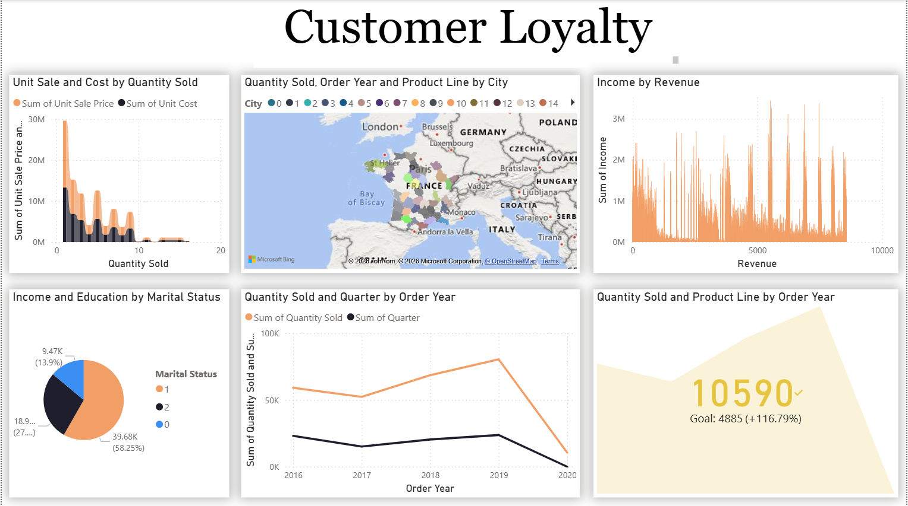

# 🎯 Customer Loyalty Prediction
 
An end-to-end machine learning project that predicts customer loyalty behavior using demographic, transactional, and engagement data — covering the complete pipeline from raw data cleaning to multi-model comparison, along with an interactive Power BI dashboard for business-facing exploration.
 
---
 
## 📌 Project Overview
 
Understanding and predicting customer loyalty helps businesses design better retention strategies, targeted offers, and personalized engagement. This project uses a **26-column, 84,436-record customer loyalty dataset** to build and compare five different classification models that predict customer loyalty outcomes.
 
The project covers the full data science lifecycle — **data cleaning → outlier & missing value treatment → multicollinearity reduction → model building → hyperparameter tuning → performance evaluation.**
 
---
 
## 🎯 Objective
 
To analyze customer demographic and purchase behavior data (income, education, product preferences, coupon response, membership duration, revenue, etc.) and build a reliable classification model that predicts customer loyalty, enabling data-driven retention and marketing decisions.
 
---
 
## 🗂️ Dataset Overview
 
- **Records:** 84,436 customers
- **Features:** 26 columns, including demographic attributes (Country, Gender, Education, Marital Status, Location Code), transactional details (Quantity Sold, Unit Sale Price, Unit Cost, Revenue), engagement metrics (MonthsAsMember, LoyaltyStatus, Coupon Response), and behavioral indicators (Customer Lifetime Value)
- **Target Variable:** `target` — the classification label representing customer loyalty outcome
---
 
## 🧹 Data Preprocessing
 
A structured, step-by-step cleaning pipeline was applied before modeling:
 
### 1. Initial Exploration
- Imported all required libraries and loaded the dataset
- Checked data types of all columns
- Reviewed aggregate statistics using `.describe()`
- Verified null/not-null status of every column using `.info()`
### 2. Duplicate & Redundant Column Handling
- Removed duplicate records to ensure data integrity
- Removed columns containing only a single unique value (no variance, no predictive value)
- Removed zero-variance numerical variables
### 3. Missing Value Treatment
- Identified categorical columns separately from numerical columns
- Imputed missing values appropriately across the dataset to ensure a complete, model-ready dataset
### 4. Outlier Treatment
- Detected and visualized outliers using **boxplots**
- Removed extreme outlier records to reduce noise and improve model stability
### 5. Multicollinearity Reduction
- Removed highly correlated feature pairs using a **correlation threshold of 0.9**
- Applied **Variance Inflation Factor (VIF)** analysis, iteratively removing features with **VIF > 5** to eliminate multicollinearity and improve model reliability
### 6. Final Cleaned Dataset
- The fully preprocessed, cleaned dataset was exported and stored as **`Customer_Loyalty.xlsx`**, serving as the model-ready input for all subsequent ML steps
---
 
## 🤖 Model Building
 
### Train-Test Split
- Data was split into **training and testing sets** with a **test size of 0.3 (70/30 split)**
### Models Implemented
Five classification algorithms were trained, tuned, and compared:
 
| Model | Description |
|---|---|
| **Logistic Regression** | Baseline linear classifier for loyalty prediction |
| **Decision Tree** | Interpretable tree-based classifier |
| **Random Forest** | Ensemble tree-based model for improved accuracy and robustness |
| **Naive Bayes** | Probabilistic classifier based on Bayes' theorem |
| **K-Nearest Neighbors (KNN)** | Distance-based classifier using nearest neighbor voting |
 
### Hyperparameter Tuning
Each of the five models was tuned to optimize performance and improve accuracy beyond their initial baseline results.
 
---
 
## 📊 Model Evaluation
 
For all five models, the following metrics and diagnostics were generated and compared:
 
- **Cross-Validation Scores**
- **Accuracy Score**
- **Precision Score**
- **Recall Score**
- **F1-Score**
- **Classification Report**
- **Confusion Matrix**
### Visual Diagnostics
- **ROC Curve** — compared true positive vs. false positive rate across all five models
- **Precision-Recall Curve** — evaluated model performance across classification thresholds
- **Validation Curve** — assessed training vs. cross-validation performance across hyperparameter ranges to detect overfitting/underfitting
---
 
## 📈 Power BI Dashboard
 

 
A companion **Power BI report (`Customer_Loyalty.pbix`)** was built on the cleaned dataset for business-facing exploration, featuring:
- A **Ribbon Chart** comparing Unit Sale Price and Unit Cost by Quantity Sold
- A **Filled Map** visualizing customers by Province/State and City
- A **Line Chart** tracking Quantity Sold and Quarterly trends over time
- A **Pie Chart** showing customer distribution by Marital Status
- A second **Ribbon Chart** comparing Revenue vs. Income
- A **KPI Card** tracking Quantity Sold performance against goals over time
This dashboard enables non-technical stakeholders to explore loyalty and sales patterns interactively, without needing to run the underlying model.
 
---
 
## 🛠️ Tools & Libraries Used
 
- **Python** — Pandas, NumPy (data manipulation)
- **Matplotlib, Seaborn** — visualization
- **Scikit-learn** — model building, hyperparameter tuning, and evaluation
- **Statsmodels** — VIF-based multicollinearity analysis
- **Microsoft Power BI** — interactive business dashboard
---
 
## 🚀 Key Highlights
 
- Cleaned and reduced a real-world dataset from 84,436 raw records down to a fully model-ready, multicollinearity-free dataset
- Built and compared **five different classification algorithms** rather than relying on a single model
- Applied rigorous statistical techniques (correlation filtering + VIF) to ensure model stability and interpretability
- Evaluated models comprehensively using both statistical metrics and visual diagnostics (ROC, Precision-Recall, Validation Curves)
- Extended the technical analysis into a **business-ready Power BI dashboard** for non-technical stakeholders
---
 
## 📈 How to Use
 
1. Clone this repository.
2. Open `Customer_Loyalty.ipynb` in Jupyter Notebook.
3. Run the cells sequentially — the notebook follows the pipeline: data loading → preprocessing → model training → tuning → evaluation.
4. Open `Customer_Loyalty.pbix` in Power BI Desktop to explore the interactive dashboard.
5. Review the final comparison plots (ROC, Precision-Recall, Validation Curves) to assess model performance.
---
 
## 📌 Future Enhancements
 
- Add ensemble/boosting models (XGBoost, LightGBM) for improved performance
- Perform feature importance/SHAP analysis for model explainability
- Deploy the best-performing model as an API for real-time loyalty scoring
- Expand the Power BI dashboard with predictive model outputs and drill-through pages
---
 
## 👤 Author
 
**Manikhanta Borra**
[LinkedIn](https://www.linkedin.com/in/manikanta-borra/)
